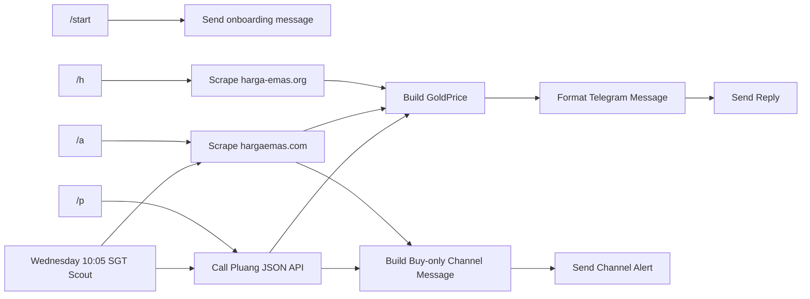

# Antam


Telegram bot for checking gold prices from multiple sources, plus a scheduled weekly channel sender.

## ❔ How It Works


## 🤖 Commands
| Command | Description |
|---|---|
| `/start` | Show onboarding and command guide |
| `/h` | Show digital gold price from `harga-emas.org` |
| `/a` | Show Antam price from `hargaemas.com` |
| `/p` | Show digital gold price from `pluang.com` |
| `/help` | Show help |

## 🔎 Price Retrieval by Command

### `/start`
`/start` does not fetch a price. It sends the onboarding message and explains which command to use for each source.

Current onboarding content:
- `/a` for Antam gold from hargaemas.com
- `/p` for digital gold from pluang.com
- `/h` for digital gold from harga-emas.org
- explanation of `Beli` and `Jual`

Example output:

```text
Halo, ini adalah bot cek harga emas Antam.

- /a untuk harga emas antam dari hargaemas.com
- /p untuk harga emas digital dari pluang.com
- /h untuk harga emas digital dari harga-emas.org
- /help untuk lihat bantuan ini lagi

Catatan:
- Beli = harga saat kamu membeli emas
- Jual = harga saat kamu menjual kembali emas
```

### `/h`
`/h` scrapes `https://harga-emas.org/` with `http.Get`, then parses the HTML with `goquery`.

Current retrieval flow:
1. Request the page with `http.Get("https://harga-emas.org/")`
2. Parse the HTML with `goquery.NewDocumentFromReader`
3. Search `table.ComprehensiveTable_table__NjmlD tbody tr`
4. Find the row whose first `td` is exactly `Gram (gr)`
5. Read the third `td` with `Eq(2)`
6. Remove nested `span` nodes and trim the remaining text
7. Use that single per-gram value for both:
   - `Beli`
   - `Jual`

Notes:
- Telegram response header: `Emas Digital - harga-emas.org`
- This path depends on the current CSS class and the `Gram (gr)` row label

Example output:

```text
Emas Digital - harga-emas.org
Beli: 2.349.910
Jual: 2.349.910
```

### `/a`
`/a` scrapes `https://hargaemas.com/` with `http.Get`, then parses the HTML with `goquery`.

Current retrieval flow:
1. Request the page with `http.Get("https://hargaemas.com/")`
2. Parse the HTML with `goquery.NewDocumentFromReader`
3. Find the first `table.table.table-bordered.table-dark`
4. Read the second table row at `tbody tr` index `1`
5. Read the first and second `td` cells
6. In each cell, extract `div.price-current`
7. Map the site values to bot labels from the user's point of view:
   - site `JUAL` -> bot `Beli`
   - site `BUYBACK` -> bot `Jual`

Example with the live site structure on August 3, 2026:
- site `JUAL`: `2.610.000` -> bot `Beli`
- site `BUYBACK`: `2.379.000` -> bot `Jual`

Notes:
- Telegram response header: `Emas Antam - hargaemas.com`
- The bot intentionally converts the site wording into user-perspective labels

Example output:

```text
Emas Antam - hargaemas.com
Beli: 2.610.000
Jual: 2.379.000
```

### `/p`
`/p` does not scrape HTML. It calls Pluang's JSON API directly.

Current retrieval flow:
1. Create a `GET` request to `https://api-pluang.pluang.com/api/v3/asset/gold/pricing?daysLimit=1`
2. Set request headers:
   - `User-Agent`
   - `Accept: application/json, text/plain, */*`
   - `Referer: https://pluang.com/`
3. Send the request with `http.DefaultClient.Do`
4. Require HTTP `200 OK`
5. Decode the JSON response body
6. Read:
   - `data.current.buy`
   - `data.current.sell`
7. Format both integer values into Indonesian thousands-separated strings with dots
8. Return them as:
   - `Beli` = `buy`
   - `Jual` = `sell`

Notes:
- Telegram response header: `Emas Digital - pluang.com`
- This command is API-backed, not selector-backed

Example output:

```text
Emas Digital - pluang.com
Beli: 2.610.000
Jual: 2.379.000
```

## ⏰ Scout Schedule
The Antam scout runs once per week on Wednesday at `10:05` Singapore time.

Current behavior:
1. The scheduler calls `getHargaEmasComPrices()`
2. The scheduler calls `getPluangGoldPrices()`
3. The bot builds a buy-only summary from the available results
4. The bot sends the message to `TELEGRAM_CHANNEL_ANTAM`

Important:
- The scheduled scout uses `hargaemas.com` and `pluang.com`
- The scheduled message includes only `Beli`
- If one source fails, the bot still sends the other source when available
- It does not use `/start` and it does not use `/h`

Example output:

```text
Emas Antam - hargaemas.com
2.610.000

Emas Digital - pluang.com
2.610.000
```

## 🛠️ Setup
### Environment Variables
| Name | Desc |
|---|---|
| `ANTAM_TELEGRAM_BOT` | Telegram bot API token for the Antam bot |
| `TELEGRAM_CHANNEL_ANTAM` | Telegram channel ID used by the weekly scout sender |

## 🧷 Notes
- The bot uses Telegram long polling.
- Source-specific parsing is fragile by nature; selector changes on `harga-emas.org` or `hargaemas.com` can break `/start` or `/a`.
- `/p` is generally less sensitive to page markup changes because it uses JSON.
