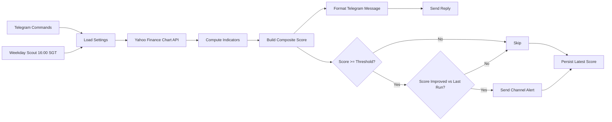

# Finance


Telegram bot for tracking a configurable finance watchlist. The watchlist can contain ETFs and single-company stocks such as `VWRA.L`, `CSPX.L`, `AAPL`, `MSFT`, or `TSLA`.

## ❔ How It Works


## 🤖 Commands
| Command | Description |
|---|---|
| `/start` | Show help |
| `/help` | Show help |
| `/a` | Analyze the saved watchlist |
| `/s TSLA` | Analyze one ticker without saving it |
| `/w` | Show the current watchlist |
| `/w add AAPL MSFT` | Add one or more tickers |
| `/w rm AAPL` | Remove one or more tickers |
| `/w set AAPL MSFT NVDA` | Replace the watchlist |
| `/w reset` | Reset to default symbols |
| `/t` | Show the alert threshold |
| `/t set 5` | Set the scout alert threshold |
| `/t reset` | Reset the threshold to default |
| `/vwra` | Analyze `VWRA.L` |
| `/cspx` | Analyze `CSPX.L` |

## ⏰ Scout Schedule
The finance scout runs once per weekday at `16:00` Singapore time.

During each run, it:
1. Loads the saved watchlist for `TELEGRAM_CHANNEL_FINANCE`
2. Analyzes every symbol in that watchlist
3. Sends a Telegram channel alert only when:
   - `CompositeScore >= alert_threshold`
   - the score is higher than the previously saved score for that same ticker
4. Saves the latest score state back to Supabase

Examples:
- `VWRA.L` from `3` to `4` with threshold `4` -> send
- `CSPX.L` from `4` to `5` with threshold `4` -> send
- `AAPL` from `5` to `5` -> skip
- `MSFT` from `6` to `4` -> skip

## 📊 Indicators
The finance score is built from four indicators in `finance/indicators.go`.

### RSI
Relative Strength Index with a 14-period window.

Signals:
- `RSI < 30` -> Oversold
- `RSI > 70` -> Overbought
- otherwise -> Neutral

Score contribution:
- `< 30` -> `+3`
- `< 40` -> `+1`
- `> 70` -> `-3`
- `> 60` -> `-1`

### MACD
Moving Average Convergence Divergence using `12, 26, 9`.

Signals:
- bullish crossover -> `+2`
- bearish crossover -> `-2`
- otherwise -> `0`

The bot compares the latest histogram against the previous histogram to detect the crossover.

### SMA
Simple moving averages using `SMA50` and `SMA200`.

Signals:
- price > `SMA50` and `SMA50 > SMA200` -> Strong Uptrend
- price < `SMA50` and `SMA50 < SMA200` -> Strong Downtrend
- price above both -> Above Both MAs
- price below both -> Below Both MAs
- otherwise -> Mixed

Score contribution:
- Strong Uptrend -> `+2`
- Strong Downtrend -> `-2`
- other states -> `0`

### Bollinger Bands
Bollinger Bands using `20` periods and `2` standard deviations.

Signals:
- near or below lower band -> bullish bias
- near or above upper band -> bearish bias
- otherwise -> within bands

Score contribution:
- Near Lower Band or Below Lower Band -> `+2`
- Near Upper Band or Above Upper Band -> `-2`
- Within Bands -> `0`

## 🧮 Composite Score
The bot adds all four indicator scores:

`CompositeScore = RSIScore + MACDScore + SMAScore + BBScore`

Recommendation mapping:
- `>= 5` -> Strong Buy
- `>= 2` -> Buy
- `>= -1` -> Neutral
- `>= -4` -> Sell
- `< -4` -> Strong Sell

## 🛠️ Setup
### Environment Variables
| Name | Desc |
|---|---|
| `TELEGRAM_BOT` | Telegram bot API token |
| `TELEGRAM_CHANNEL_FINANCE` | Finance channel ID |
| `SUPABASE_URL` | Supabase URL |
| `SUPABASE_KEY` | Supabase key |

### Supabase Table Definition
The finance bot stores everything in a single table.

```sql
create table public."FinanceWatchlists" (
  chat_id bigint primary key,
  symbols text not null,
  alert_threshold integer not null default 5,
  score_state text not null default '{}'
);
```

Column meanings:
- `chat_id`: Telegram chat or channel ID
- `symbols`: comma-separated watchlist, for example `AAPL,MSFT,VWRA.L`
- `alert_threshold`: minimum composite score required for scout alerts
- `score_state`: JSON text of the last saved composite score per ticker, for example `{"AAPL":4,"VWRA.L":5}`

## 🧷 Notes
- Manual analysis commands always return the current analysis immediately.
- Supabase is the only persistent store for finance settings.
- If a finance settings row does not exist yet, the bot falls back to default symbols and default threshold in code.
