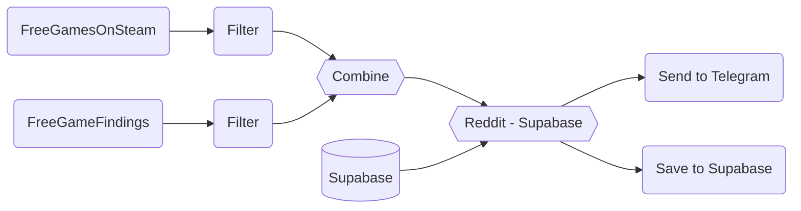

# Free Games on Steam & Epic

## [Link](https://t.me/free_games_on_steam)

Telegram bot to help you find cool free games on Steam and Epic Games. 
Basically this bot will find _cool_ free games that is free to be kept on Steam or Epic Games. 
The bot then will send the game URL into a telegram channel.

## ❔ How it Works

1. `FreeGamesOnSteam` ➡️ Pull top reddit post from FreeGamesOnSteam then applied filter criteria:
    - Reddit post votes above 200
    - Post not older than 7 days
    - `link_flair_text` is not **Ended**
   
2. `FreeGameFindings` ➡️ Pull top reddit post from FreeGameFindings then applied filter criteria:
   - Reddit post votes above 300
   - Post not older than 7 days
   - `link_flair_text` is not **Mod Post**
   - `link_flair_text` is not **Regional Issues**
   - `link_flair_text` is not **Expired**
   
3. `Combine` ➡️ Combine both list of Reddit Posts

4. `Supabase` ➡️ Get All Post from Supabase Db

5. `Reddit - Supabase` ➡️ Keep Reddit posts that is not in Supabase

6. `Send to Telegram` ➡️ Send Post(s) to Telegram Channel as a Bot

7. `Save to Supabase` ➡️ Save Post(s) to Supabase Db

**note:** _Post in the db will be cleanup(old Post) daily to reduce db size_

## 🛠️ Setup
### Environment Variables
| Name                              | Desc                   |
|-----------------------------------|------------------------|
| TELEGRAM_BOT                      | Telegram bot API Token |
| TELEGRAM_CHANNEL_FREE_GAMES       | Channel ID             |
| SUPABASE_URL                      | Supabase URL           |
| SUPABASE_KEY                      | Supabase Key           |
