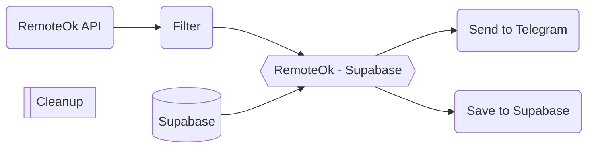

# Remote Ok
Remote Ok Bot

## ❔ How it Works

1. `RemoteOk API` ➡️ Pull jobs posting from remoteOk API then applied filter criteria:
    - Job posting not older than 7 days

2. `Supabase` ➡️ Get All Job from Supabase Db

3. `RemoteOk - Supabase` ➡️ Keep RemoteOk Job Posting that is not in Supabase

4. `Send to Telegram` ➡️ Send Job(s) to Telegram Channel as a Bot

5. `Save to Supabase` ➡️ Save Job(s) to Supabase Db

**note:** _Job in the db will be cleanup(old job post) daily to reduce db size_

## 🛠️ Setup
### Environment Variables
| Name                        | Desc                   |
|-----------------------------|------------------------|
| TELEGRAM_BOT                | Telegram bot API Token |
| TELEGRAM_CHANNEL_REMOTE_OK  | Telegram Channel id    |
| SUPABASE_URL                | Supabase URL           |
| SUPABASE_KEY                | Supabase Key           |
