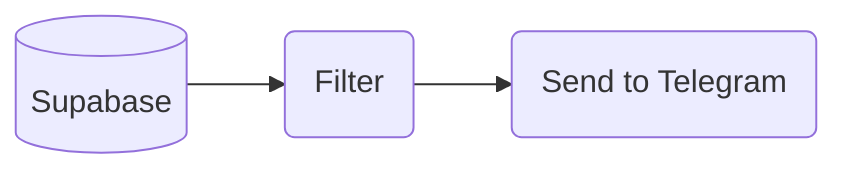

# Rss Feed
Rss Feed Bot

## ❔ How it Works

1. `Supabase` ➡️ Get All Feeds from Supabase Db

2. `Filter` ➡️ Keep items that is not older than 7 days ago

3. `Send to Telegram` ➡️ Send Rss item(s) to Telegram Channel as a Bot

```
Run every Saturday at 11.05 AM
```

## 🛠️ Setup
### Environment Variables
| Name                 | Desc                   |
|----------------------|------------------------|
| TELEGRAM_BOT         | Telegram bot API Token |
| TELEGRAM_CHANNEL_RSS | Telegram Channel id    |
| SUPABASE_URL         | Supabase URL           |
| SUPABASE_KEY         | Supabase Key           |