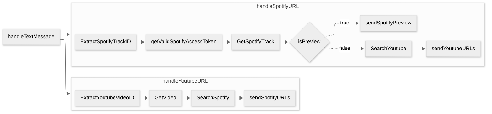

# Spotifytube
Function Chain Call Chart for Spotifytube

```mermaid
---
config:
  look: neo
  theme: neutral
  layout: elk
---
flowchart LR
 subgraph Y["handleYoutubeURL"]
        V["GetVideo"]
        Ey["ExtractYoutubeVideoID"]
        Ss["SearchSpotify"]
        Ssu["sendSpotifyURLs"]
  end
 subgraph S["handleSpotifyURL"]
        P["sendSpotifyPreview"]
        iP{"isPreview"}
        G["getValidSpotifyAccessToken"]
        E["ExtractSpotifyTrackID"]
        T["GetSpotifyTrack"]
        SY["SearchYoutube"]
        Syu["sendYoutubeURLs"]
  end
    A["handleTextMessage"] --> S & Y
    Ey --> V
    V --> Ss
    Ss --> Ssu
    E --> G
    G --> T
    T --> iP
    iP -. false .-> SY
    iP -. true .-> P
    SY --> Syu

```